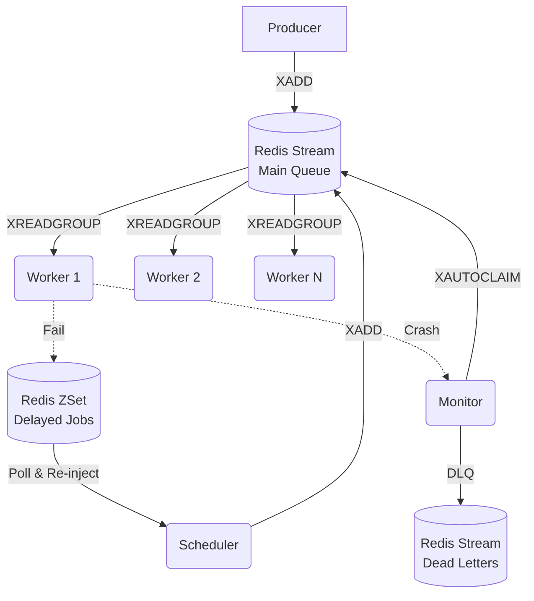

<div align="center">
  <h1>🚀 distqueue</h1>
  <p><strong>A Redis-backed distributed job queue and task scheduler, built from scratch in Python.</strong></p>
</div>

<br />

`distqueue` is a high-performance, fully observable distributed job queue. It is built strictly on top of Redis primitives (Streams, Hashes, and Sorted Sets) without relying on heavy frameworks like Celery or RQ. 

This project demonstrates core distributed systems concepts such as **consumer groups, heartbeat-gated failure detection, exponential backoff, dead-letter queues (DLQ), and Prometheus/Grafana observability.**

---

## 🏗️ Architecture



### 🧠 Core Primitives
* **Main Queue (`jobs:stream:default`)**: A Redis Stream. Workers consume jobs using Consumer Groups (`XREADGROUP`) ensuring each job is delivered to exactly one worker.
* **Job State (`job:{uuid}`)**: A Redis Hash holding the authoritative state of the job (payload, attempts, status, last error).
* **Retry Scheduler (`jobs:delayed`)**: A Redis Sorted Set (`ZSet`) where jobs that throw exceptions are stored with an exponential backoff score.
* **Dead Letter Queue (`jobs:dlq`)**: A separate Redis Stream for permanently failed jobs that exceed `max_attempts`.
* **Heartbeats (`worker:{id}:heartbeat`)**: Ephemeral keys with TTLs. Workers ping them continuously.

### ⚙️ Components
1. **Producer**: Atomically writes job hashes and stream pointers using Lua-like pipelines (`MULTI/EXEC`) to prevent orphaned jobs.
2. **Worker**: Consumes jobs via blocking reads, processes them, and emits background heartbeats. Handles transient failures with exponential backoff and jitter.
3. **Scheduler**: A singleton process that polls the delayed ZSet and re-injects jobs into the main stream when their backoff timer expires.
4. **Monitor**: A "reaper" process that detects dead workers (expired heartbeats) and reclaims their stuck jobs via `XAUTOCLAIM`.

---

## 📊 Observability (Prometheus & Grafana)

The entire cluster is deeply instrumented with Prometheus metrics. We track:
* **Throughput**: Jobs completed per second.
* **Latency**: Job duration percentiles (`p50`, `p95`, `p99`) via histograms.
* **Queue Health**: Stream depth, delayed ZSet size, and Pending Entries List (PEL) size.
* **Failures**: Segmented by outcome (retried vs DLQ) and trigger (exception vs worker crash).

---

## 🚀 Getting Started

### 1. Run the Full Stack with Docker Compose
To spin up Redis, Prometheus, Grafana, a Monitor, a Scheduler, and 3 scaled Workers:

```bash
docker compose -f docker/docker-compose.yml up --build --scale worker=3 -d
```

*Note: Prometheus dynamically discovers scaled worker replicas via Docker DNS (`dns_sd_configs`), completely avoiding port conflicts.*

### 2. View the Live Dashboard
Grafana is automatically provisioned with the datasource and dashboard.
1. Open **[http://localhost:3000](http://localhost:3000)**
2. Log in with `admin` / `admin` (or skip, anonymous access is enabled)
3. Go to Dashboards -> **Distqueue Metrics**

### 3. Generate Traffic
Run the producer script locally to pump jobs into the system and watch the dashboard light up:

```bash
.venv/Scripts/python scripts/run_producer.py
```

---

## 🧪 Testing

The system boasts a robust test suite (50+ tests) verifying atomic transactions, failure recovery, and horizontal scaling.

```bash
# Unit tests only (fast, no Redis required)
.venv/Scripts/pytest -m "not integration" -v

# Integration tests only (requires Redis running locally)
.venv/Scripts/pytest tests/integration -v

# Run the full suite
.venv/Scripts/pytest -v
```
